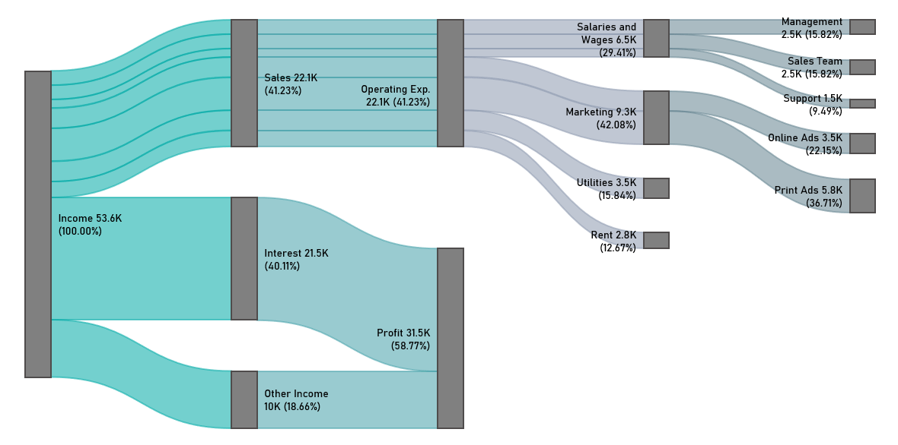

## 📊 Sankey Diagram Examples Gallery

Below you’ll find a selection of real-world Sankey diagram examples created with the ChartEngine Excel add-in.

Click on each image to view in full size.

---

### 💡 Income & Finance Visualizations

**Income Statement Template in Excel**

**Monthly Cash Flow Template**

**Monthly Financial Report Example**

**Cash Flow Diagram in Excel**

---

### 📉 Profit & Expense Tracking

**Income and Expenditure Tracker**

**Profit and Loss Template**

---

### ⚙️ Advanced Use Cases

**Clean Energy Flow Allocation**

**Three-Statement Financial Model**

**Cash Flow Analysis Example**

**Visual Analytics for Complex Systems**

---

📝 *All diagrams were built using Excel and rendered via the ChartEngine add-in. You can use these examples as inspiration or templates for your own Sankey visualizations.*

